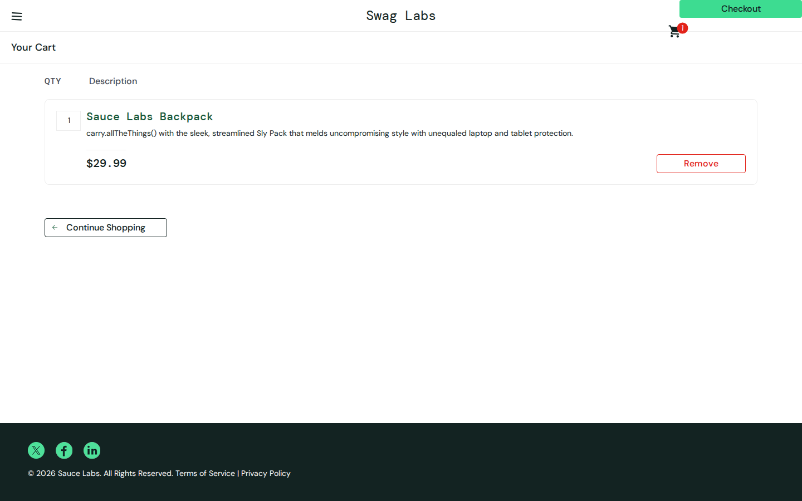
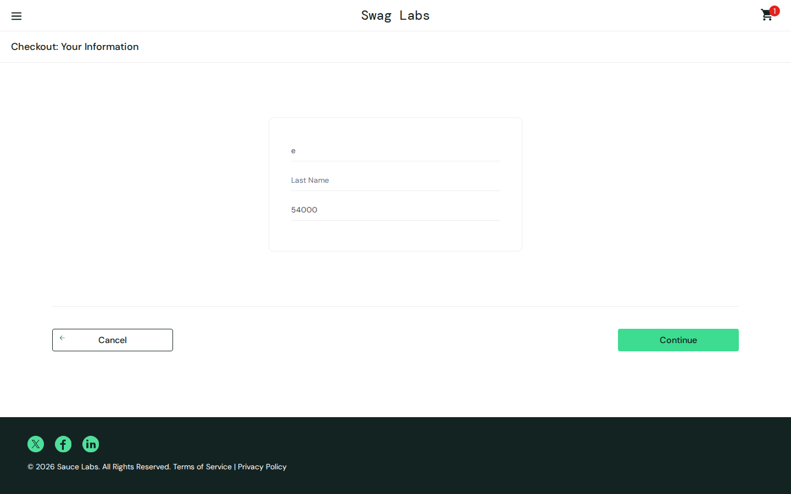
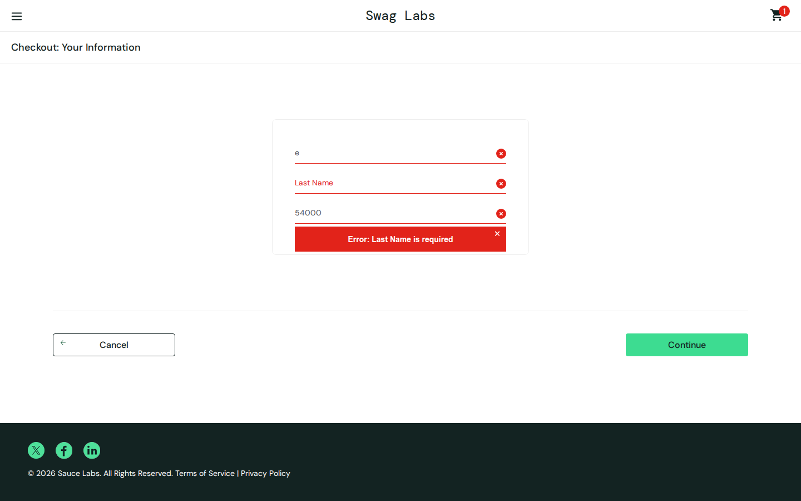
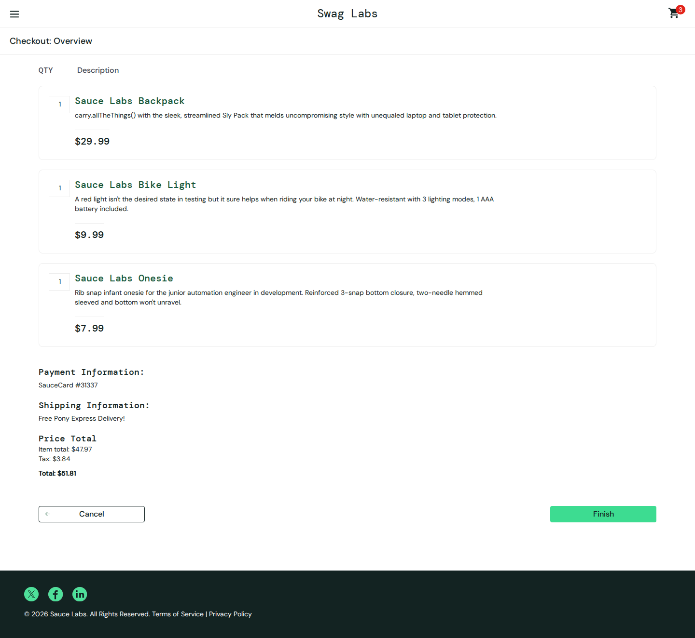
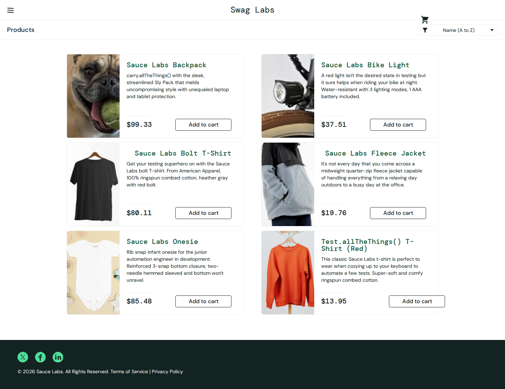
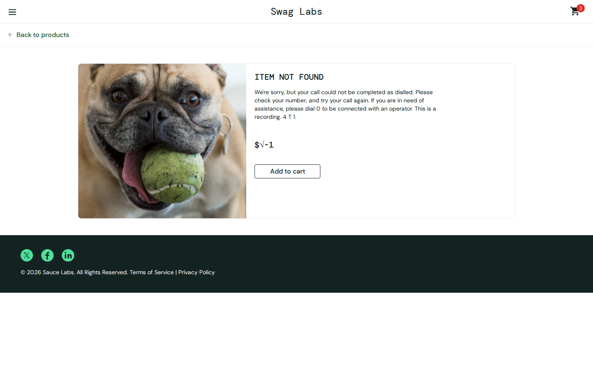
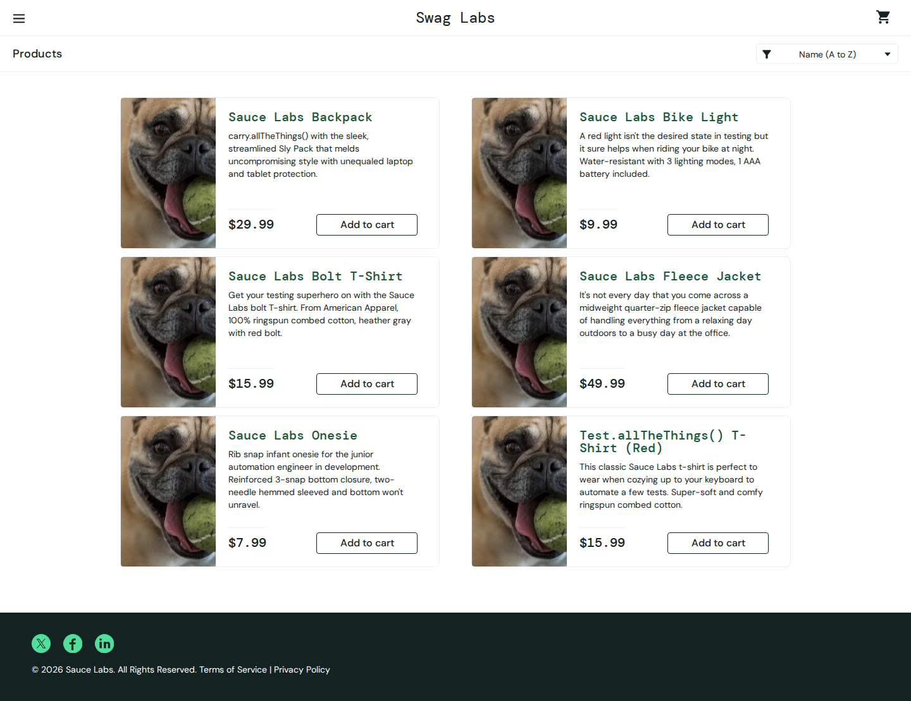

# SQA Engineer assessment — SauceDemo

Prepared by: Mominah
Application: https://www.saucedemo.com/
Primary account: `standard_user` / `secret_sauce`
Tested: 1 October 2026
Exploratory browser: Chromium 153, viewport 1440×900, driven with Playwright so each check could be repeated
Automated test: Playwright Test, Desktop Chrome, fresh context per run (passed twice)
Repository: https://github.com/bibimomina/saucedemo-sqa-assessment

The six usernames on the login page were all exercised. Only behaviour that was reproduced on the live site is reported below. The public Sauce Labs sample-app source was used to form hypotheses. It was not treated as proof until the same failure showed up in the UI or the console.

Screenshots are in `evidence/`. The runnable test and setup steps are in `README.md`.

## Risk focus

The journeys that can lose money or ship the wrong goods:

1. Session and cart ownership. A cart that survives logout will be bought by the next person on that browser.
2. Catalog truth. The title, image, detail page, and price have to be the same product.
3. Checkout completion. A shopper who cannot enter a last name, or who clicks Finish and stays on the overview, has not bought anything.
4. The amount charged. Shelf price, cart price, tax, and total have to agree.

Login of `standard_user`, sorting, and an ordinary two-item checkout all worked. Those were checked so the defects below are not "the site is down".

---

## Task A — AI-assisted exploration

Five prompts were used. Each one was a question with a decision after it, not a request for a test-case spreadsheet.

### Prompt 1

**Purpose.** Decide where to spend the time.

> You are testing https://www.saucedemo.com/, a small shop with six published accounts and the password secret_sauce. Do not write test cases. Name the four user journeys where a defect would cost money or ship the wrong item, and the questions a tester should answer on each. Ignore cosmetic nits unless they block a purchase.

**Useful output.** Ranked the work as cart/session, catalog identity, checkout completion, and price integrity. Suggested checking an empty cart, a second account in the same browser, and whether Back after logout still shows products.

**What I did with it.** Those four journeys were the session. The empty-cart and Back-button ideas were tested. The Back-button idea was rejected (see "Checked and not filed"). The empty cart is real and was ranked below the five defects.

### Prompt 2

**Purpose.** Get a hypothesis list, then try to kill it.

> For standard_user, problem_user, error_user, visual_user, performance_glitch_user, and locked_out_user, list likely functional failures in sorting, images, add to cart, checkout fields, and order completion. Mark which failures would be intentional test fixtures rather than defects. I will only keep what I can reproduce.

**Useful output.** Predicted broken images and a last-name problem for `problem_user`, a finish-step exception for `error_user`, unstable prices for `visual_user`, a multi-second delay for `performance_glitch_user`, and a lockout message for `locked_out_user`. Also predicted that Name (Z to A) was broken for `standard_user` and that tax rounding was wrong on a normal order.

**Accepted after a live run.** Last name on `problem_user`, Finish on `error_user`, random shelf prices on `visual_user`, wrong detail pages, and the glitch delay (measured, not filed).

**Rejected after a live run.**

- Name (Z to A) on `standard_user` is correct. The order was Test.allTheThings() T-Shirt (Red), Onesie, Fleece Jacket, Bolt T-Shirt, Bike Light, Backpack.
- Tax on backpack + bike light is correct: item total $39.98, tax $3.20, total $43.18. That is 8% of 39.98 (3.1984) rounded to cents, then added back.
- `locked_out_user` is not a defect. The message is `Epic sadface: Sorry, this user has been locked out.` and the user stays on the login page. Evidence: `evidence/25-locked-out.png`.

### Prompt 3

**Purpose.** Attack session handling, because the first prompt flagged it and the second prompt did not.

> How does this app store the cart and the session? What should happen if user A adds a product, logs out, and user B logs in inside the same browser? What should happen on browser Back, and on opening /inventory.html with no session?

**Useful output.** Predicted a cookie session and a cart that might be global.

**Validated.** After logout the session cookie is gone and `localStorage["cart-contents"]` is still `[4]` (the backpack). `visual_user` then sees that backpack. Direct navigation to `/inventory.html` while logged out returns to login with `Epic sadface: You can only access '/inventory.html' when you are logged in.` Browser Back after logout also shows the login page, not the inventory. So the route guard works. The cart storage does not. Only the cart finding was filed (DEF-001).

### Prompt 4

**Purpose.** Design one automated flow and list ways the generated test would lie.

> Draft one Playwright test: standard_user, add Sauce Labs Backpack and Sauce Labs Bike Light, checkout, assert success. Then list the ways that test can pass while the order is wrong.

**Useful output.** A page-object sketch, and three honest warnings: asserting only the thank-you heading, sharing browser state, and sleeping for several seconds.

**What changed.** The thank-you heading was kept, but it is not the proof. The test also checks both names, both prices, quantity, the required-field error, the 8% tax, and an empty cart. See Task C for the selector bug that the draft actually shipped.

### Prompt 5

**Purpose.** Write the QA proposal from the mistakes in this exercise, not from a generic AI policy.

> Given that an AI draft mis-filed locked_out_user, mis-filed a logout bypass, and produced a test that looked for data-testid on a data-test app, write a one-page QA approach for a team that lets developers generate code and tests with AI. Be specific about the gate that stops a generated test entering CI.

**Useful output.** The structure of Task D. The examples were replaced with the ones from this session so the proposal is about this product, not a template.

---

## Task B — Defects

Ranked by user impact, then likelihood on a shared browser. Five are filed. Further confirmed issues are listed after them, with the reason they did not take a slot.

Severity is the harm to the shopper or the business. Priority is how soon it should be fixed. Critical means the purchase cannot be completed or the price is impossible. High means the wrong goods or another person's cart. Medium means a real rule break with a smaller blast radius.

### DEF-001 — Cart is not isolated to the logged-in session

| | |
|---|---|
| Severity / priority | High / P1 |
| Accounts | `standard_user`, then `visual_user` in the same browser |
| Evidence | `evidence/08-cross-user-cart.png` |

**Steps**

1. Log in as `standard_user` / `secret_sauce`.
2. Add Sauce Labs Backpack.
3. Open the menu and click Logout.
4. Log in as `visual_user` / `secret_sauce`.
5. Open the cart.

**Expected.** Logging out ends that shopper's session and that shopper's basket. The next account in the same browser starts with an empty cart.

**Actual.** This is a cross-account session isolation failure, not ordinary "remember my cart" behaviour. Logout clears the session cookie and leaves `localStorage["cart-contents"]` set to `[4]`. The cart is not stored against the username. `visual_user` then sees Sauce Labs Backpack at $29.99, with the badge on 1. That is the real backpack price, and `visual_user` did not add it, so the line belongs to the previous session.

**Impact.** On a shared computer the next person inherits the previous basket and can check it out. What the previous shopper was about to buy is also visible. It happens on the primary account, not only on the broken personas.

### DEF-002 — problem_user cannot enter a last name, so checkout never completes

| | |
|---|---|
| Severity / priority | Critical / P1 |
| Account | `problem_user` |
| Evidence | `evidence/26-problem-checkout-fields.png`, `evidence/27-problem-checkout-blocked.png` |

**Steps**

1. Log in as `problem_user` / `secret_sauce`.
2. Add Sauce Labs Backpack and open the cart. Checkout.
3. Enter first name `John`.
4. Click Last Name and type `Doe`.
5. Enter postal code `54000`.
6. Click Continue.

**Expected.** First name stays `John`, last name is `Doe`, and the shopper reaches Checkout: Overview.

**Actual.** Last Name stays empty. First name is replaced by the last character typed into Last Name, so the field shows `e` rather than `John`. Continue shows `Error: Last Name is required` and the URL stays `/checkout-step-one.html`. The last-name field cannot be filled, so this account cannot place an order.

**Impact.** Every checkout for a published account dies on the customer form, and the first name the shopper already typed is destroyed. There is no workaround in the UI.

### DEF-003 — error_user can reach the overview, then Finish does nothing

| | |
|---|---|
| Severity / priority | Critical / P1 |
| Account | `error_user` |
| Evidence | `evidence/21-error-finish.png` |

**Steps**

1. Log in as `error_user` / `secret_sauce`.
2. Add Sauce Labs Backpack, Sauce Labs Bike Light, and Sauce Labs Onesie. These three do add. (Bolt T-Shirt, Fleece Jacket, and the red T-shirt throw `Error: Failed to add item to the cart.` and stay out of the cart.)
3. Open the cart and click Checkout.
4. Enter first name `Err` and postal code `1`. Try to type a last name.
5. Click Continue.
6. On Checkout: Overview, click Finish.

**Expected.** Last name accepts input. Finish shows `Thank you for your order!` and clears the cart.

**Actual.** Each character in Last Name throws `TypeError: Cannot read properties of undefined (reading 'value')`. The field stays empty. Continue is still allowed. The overview is arithmetically consistent for the three items that were added: item total $47.97, tax $3.84, total $51.81. Finish then throws `TypeError: La.cesetRart is not a function`. The page does not change. The URL stays `/checkout-step-two.html`, the thank-you heading never appears, and the cart badge stays on 3. The UI shows no error, so the shopper has no reason to think anything other than "the button is dead".

**Impact.** The pay step cannot be completed. The cart is not cleared, so a retry hits the same exception. The misspelled reset (`cesetRart`) matches the public sample-app source. The source was only a hint. The defect is the live Finish click.

### DEF-004 — visual_user shelf price is random and is not the price in the cart

| | |
|---|---|
| Severity / priority | High / P1 |
| Account | `visual_user` |
| Evidence | `evidence/22-visual-inventory.png`, `evidence/23-visual-cart.png` |

**Steps**

1. Log in as `visual_user` / `secret_sauce`.
2. Read the Sauce Labs Backpack price on the product list.
3. Reload the inventory page and read that price again.
4. Add the backpack and open the cart.

**Expected.** The backpack keeps a stable shelf price, and the cart shows that same price ($29.99).

**Actual.** First load showed the backpack at **$99.33**. After reload the same card showed **$77.88**. The cart charged **$29.99**. Every other shelf price also changed across the reload (bike light $37.51 then $85.18, bolt T-shirt $80.11 then $4.73, fleece $19.76 then $13.96, onesie $85.48 then $5.38, red T-shirt $13.95 then $31.74). The backpack image on the shelf is the broken dog image, not the backpack.

**Impact.** The customer cannot tell what they will pay, and a refresh changes the advertised price. The amount in the cart is the real catalog price, so the shelf price is false.

### DEF-005 — problem_user product titles open a different product

| | |
|---|---|
| Severity / priority | High / P1 |
| Account | `problem_user` |
| Evidence | `evidence/14-problem-detail-Jacket.png`, `evidence/11-problem-inventory.png` |

**Steps**

1. Log in as `problem_user` / `secret_sauce`.
2. On the product list, click the title Sauce Labs Fleece Jacket.

**Expected.** The detail page is the fleece jacket, priced at $49.99, with the jacket photo.

**Actual.** The URL is `/inventory-item.html?id=6`. The heading is `ITEM NOT FOUND`. The price is `$√-1`. The copy is a telephone-recording error ending in "4 T 1". The image is the dog placeholder. The same off-by-one happens for every title. Backpack opens the fleece jacket (`id=5`, $49.99). Bike Light opens the bolt T-shirt (`id=1`). Bolt T-shirt opens the onesie. Onesie opens the red T-shirt. The red T-shirt opens the backpack.

On the list itself, all six photos are the same dog image (`/assets/sl-404-….jpg`), so the shelf cannot be used to tell the products apart either.

**Impact.** A shopper follows a title and lands on a different item, or on a page that is not a product and shows a price that is not a number. That is a wrong-goods defect, not a cosmetic one.

### Confirmed, and not given one of the five slots

These were reproduced. They are listed so the ranking is visible, not to pad the report.

| Observation | Why it is not DEF-001 to DEF-005 |
|---|---|
| `problem_user`: Bolt T-Shirt, Fleece Jacket, and the red T-shirt do not add. No error. Badge unchanged. | Same account as DEF-002 and DEF-005. Checkout is already impossible, so the dead buttons are the second failure on a journey that cannot be paid for. |
| `problem_user`: Remove on the backpack does nothing. The button stays Remove and the badge stays 1. | Same reason. Cart removal from the inventory card is broken for the items that do add. |
| `problem_user`: Name (Z to A) does not reorder the list. | Sort is broken, and the purchase path is already blocked by DEF-002. |
| `error_user`: choosing a sort shows `Sorting is broken! This error has been reported to Backtrace.` and the order does not change. | Real, and noisy, but DEF-003 already stops the payment. |
| `standard_user` can check out with an empty cart. Overview says item total $0, tax $0.00, total $0.00, and Finish still shows the thank-you page. Evidence: `evidence/07-empty-cart-complete.png`. | Medium / P2. No payment is captured on this demo, so the harm is a false order rather than a wrong charge. It is also why the automated test must not treat the thank-you string as proof. |
| `performance_glitch_user` takes about 5.1 seconds from Login to the inventory page (measured 5085 ms), then the catalog works. | The delay is real and it blocks the main thread, but it is confined to the account whose name describes it, and the purchase path still completes. I would track it as a performance budget if that account were a real segment. I would not put it ahead of a checkout that cannot finish. |
| `visual_user`: the Checkout button is drawn over the header (`btn_visual_failure`, top of the viewport) instead of beside Continue Shopping. Visible on `evidence/23-visual-cart.png`. | Separate from DEF-004. The button still works. The false shelf price is the purchase-trust failure, so the layout bug did not take one of the five slots. |

### Checked, and not defects

- `locked_out_user` with the right password. Specific error, no session. Working as the screen implies.
- Usernames and the password printed on the login page. That is the published fixture for this exercise, not a leaked secret.
- Browser Back after logout, and opening `/inventory.html` logged out. Both return to the login page. An early AI note said Back would still show the inventory. It does not, on this build. Evidence: `evidence/09-after-back.png`, `evidence/10-direct-inventory-logged-out.png`.
- `standard_user` sort Z to A, and tax on a $39.98 order. Both match the rule above. Evidence of the good total: `evidence/04-standard-overview.png`.

---

## Task C — Automation

Repository contents:

- `tests/checkout.spec.ts` — the one end-to-end test
- `pages/` — login, inventory, cart, checkout
- `playwright.config.ts` — `data-test` as the test id attribute, Chromium, no retries
- `README.md` — setup, what is asserted, what AI got wrong, limitations

`npm test` passed on two consecutive runs (about 2 seconds each) against the live site.

AI assistance on this task was the first draft of the page objects and the flow. The corrections are in the README. The one that actually failed the suite: Playwright's `getByTestId` looks up `data-testid`, and this site uses `data-test`. The login form was on screen and the test still timed out. That was fixed in config, not by switching to a brittle CSS selector.

The five defects above are not encoded as expected results. A regression test for them belongs in the suite only after someone confirms the correct behaviour. Until then, an assertion such as "Finish throws" would make the bug the oracle.

---

## Task D — QA on an AI-driven team

One page.

AI belongs in QA where a wrong answer costs an hour of drafting. It does not get to decide whether the product is right. On this exercise a draft filed `locked_out_user` as a defect, claimed Back bypassed logout, and wrote a test for `data-testid` on a `data-test` app. All three sounded finished. The live site refuted each one.

**Where AI earns its place.** Risk charters (who is harmed, which journey moves money, which accounts are fixtures). Boundary data, exploratory questions, and a first Playwright draft. Clustering CI failures and duplicate bugs. A suggested subset of tests when a diff touches the cart or checkout. A first write-up of a trace, a screenshot, and a console error.

**Where a person decides.** Whether behaviour is a defect, a fixture, or a pass. The lockout message and the named 5-second account are fixtures. The cart that outlives logout is a defect. Priority: a $0 empty-cart order is real and still less urgent than Finish doing nothing, or a shelf price that changes on refresh. Any assertion that states a business rule (tax, cart ownership, what "complete" means). Admission of a generated test into the regression suite.

**Review before a generated test joins the suite.**

1. It must fail for the right reason on a broken build. A green run is not a review.
2. Selectors use a stable contract (`data-test` here). Shared CSS classes are rejected.
3. Assertions check the outcome. `Thank you for your order!` also appears for a $0 empty cart, so it cannot be the only check.
4. The test starts from a clean context. This cart is in `localStorage` and leaks across logins in a shared profile.
5. A person runs it, reads the trace, and deletes steps that protect nothing. Fixed sleeps go. The glitch account's 5-second pause does not belong on the `standard_user` test.

**CI.** The pull-request gate is the agreed smoke test: this checkout, on Chromium. Red there blocks merge. AI may nominate extra tests for a diff; they stay advisory until they pass the review above. A red generated test does not block the pipeline by itself. Nightly can run the wider set, including defect checks once product has confirmed the expected result. AI does not rewrite assertions because the UI changed. That blesses regressions.

**Risks and mitigations.** No defect is filed without a live run and a screenshot or console error. Expected values come from the rule (8% tax, half-up to cents), not from copying a buggy label. Source is a hint, not a result: `cesetRart()` became DEF-003 only after Finish was clicked and the overview stayed put. This demo password is printed on the login page. Production credentials do not go into a prompt.

---

## Tools

- Playwright 1.63 and Chromium, for the exploratory session (`scripts/explore.cjs`, `scripts/probe-checkout.cjs`) and for the regression test.
- The live site at https://www.saucedemo.com/.
- The public sample-app source (Sauce Labs) as a hypothesis source only.
- An AI coding assistant for the five prompts above, the first test draft, and a first pass of this write-up. Every defect in Task B was then reproduced on the site, and the rejected items in Task A were rejected because the site disagreed.
